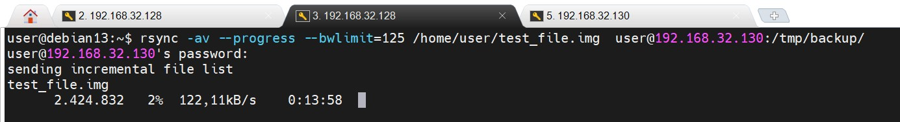
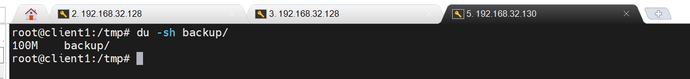
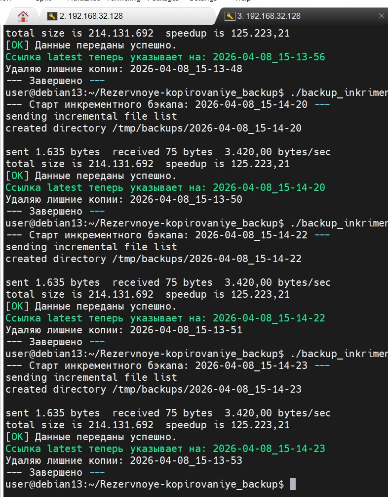
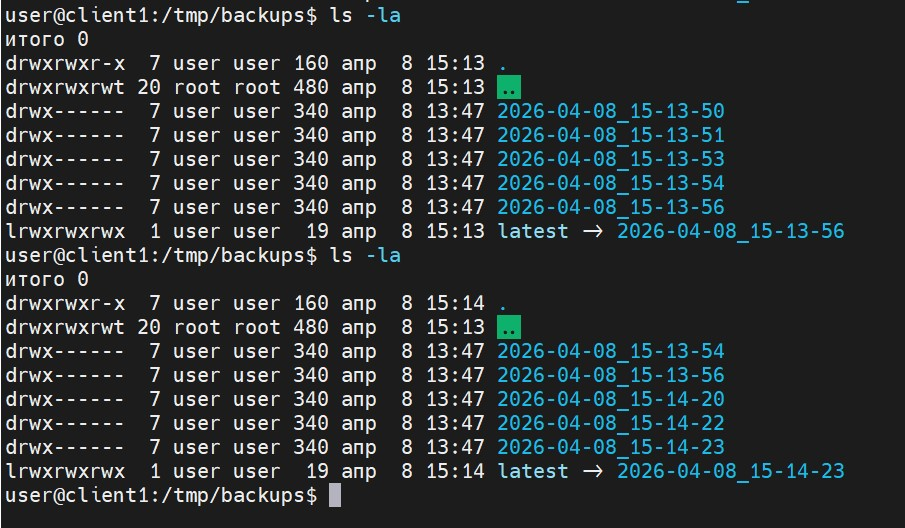
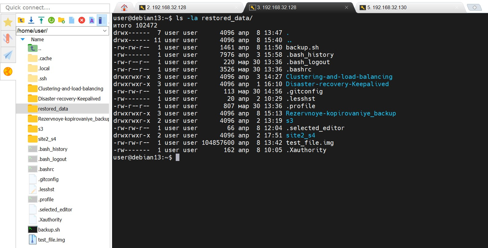

# Домашнее задание к занятию 3 «Резервное копирование» - Бобков Александр
<details>
<summary><b>Задание 1</b></summary>

- Составьте команду rsync, которая позволяет создавать зеркальную копию домашней директории пользователя в директорию `/tmp/backup`
- Необходимо исключить из синхронизации все директории, начинающиеся с точки (скрытые)
- Необходимо сделать так, чтобы rsync подсчитывал хэш-суммы для всех файлов, даже если их время модификации и размер идентичны в источнике и приемнике.
- На проверку направить скриншот с командой и результатом ее выполнения.

### ОТВЕТ:
# Резервное копирование домашней директории

Для создания зеркальной копии домашней директории в `/tmp/backup` с проверкой по хеш-суммам и исключением скрытых папок используется следующая команда:

```bash
rsync -av --delete --checksum --exclude='.*/' ~/ /tmp/backup/
```
Разбор параметров:

    -a (archive) — рекурсивное копирование с сохранением прав и метаданных.
    -v (verbose) — подробный вывод процесса работы.
    --delete — удаление файлов в приемнике, если они исчезли в источнике (зеркалирование).
    --checksum — принудительная проверка целостности файлов по хеш-суммам вместо сравнения по дате/размеру.
    --exclude='.*/' — игнорирование всех скрытых директорий.

<summary>Результат проверки команды на скриншоте</summary>


* Добавим файл `test.txt`  и повторим создание backup

<summary>Результат проверки добавления нового созданного файла в backup</summary>


</details>

------
------


<details>
<summary><b>Задание 2</b></summary>

- Написать скрипт и настроить задачу на регулярное резервное копирование домашней директории пользователя с помощью rsync и cron.
- Резервная копия должна быть полностью зеркальной
- Резервная копия должна создаваться раз в день, в системном логе должна появляться запись об успешном или неуспешном выполнении операции
- Резервная копия размещается локально, в директории `/tmp/backup`
- На проверку направить файл crontab и скриншот с результатом работы утилиты.
------

### ОТВЕТ:
### 1. Создание «умного» скрипта резервного копирования
Скрипт поддерживает два режима: интерактивный (запрашивает пути у пользователя) и автоматический (использует значения по умолчанию для cron).

```bash
#!/bin/bash

# Настройки по умолчанию (для работы через cron)
DEFAULT_SOURCE="$HOME/"
DEFAULT_TARGET="/tmp/backup"

# Проверяем, запущен ли скрипт в интерактивном режиме (есть ли терминал)
if [ -t 0 ]; then
    # Режим ручного запуска: спрашиваем пользователя
    echo "--- Интерактивный режим резервного копирования ---"
    
    read -p "Источник [$DEFAULT_SOURCE]: " SOURCE_DIR
    SOURCE_DIR=${SOURCE_DIR:-$DEFAULT_SOURCE} # Если нажать Enter, возьмет значение по умолчанию
    
    read -p "Назначение [$DEFAULT_TARGET]: " TARGET_DIR
    TARGET_DIR=${TARGET_DIR:-$DEFAULT_TARGET}
else
    # Режим cron: используем настройки по умолчанию без вопросов
    SOURCE_DIR=$DEFAULT_SOURCE
    TARGET_DIR=$DEFAULT_TARGET
fi

# Проверка источника
if [ ! -d "$SOURCE_DIR" ]; then
    logger "Backup error: Directory $SOURCE_DIR not found"
    exit 1
fi

# Создание папки назначения
mkdir -p "$TARGET_DIR"

# Запуск зеркалирования
if rsync -av --delete --checksum --exclude='.*/' "$SOURCE_DIR" "$TARGET_DIR"; then
    logger "Backup successful: $SOURCE_DIR to $TARGET_DIR"
else
    logger "Backup failed: $SOURCE_DIR to $TARGET_DIR"
fi
```

### 2. Настройка прав и планировщика cron

Чтобы скрипт запускался ежедневно в 03:00, необходимо выполнить следующее:

1. `chmod +x backup.sh` (сделать исполняемым).
2. `crontab -e` и добавьте строку:

```config
0 3 * * * /bin/bash /home/$(whoami)/Rezervnoye-kopirovaniye_backup/backup.sh
```

### 3. Проверка работоспособности

- Для проверки поставил в cron выполнение каждую минуту
<summary>Настройка cron</summary>


- Для просмотра лога журналов через journalctl в консоли:

```config
journalctl | grep "Backup" | tail -n 5
```
<summary>Просмотр содержимого `/tmp` и логов через journalctl</summary>


</details>

-------
-------

<details>
<summary><c>Задание 3*</c></summary>

- Настройте ограничение на используемую пропускную способность rsync до 1 Мбит/c
- Проверьте настройку, синхронизируя большой файл между двумя серверами
- На проверку направьте команду и результат ее выполнения в виде скриншота
-------

### ОТВЕТ:


### 1. Для ограничения скорости в rsync используется специальный флаг `--bwlimit`
(В параметре --bwlimit значение указывается в Кибибайтах в секунду)

- Команда для синхронизации файла будет иметь следующий вид:

```config
rsync -av --progress --bwlimit=125 /путь/к/большому_файлу пользователь@удаленный_хост:/tmp/backup/
```

```
Используемые "ключи":

--bwlimit=125: ограничивает скорость передачи до ~1 Мбит/с.
--progress: покажет текущую скорость передачи в реальном времени.
-a: архивный режим (сохранение прав).
-v: подробный вывод.
```

### 2. Создадим большой файл 100MБ:

```config
dd if=/dev/zero of=test_big_file.img bs=1M count=100
```

### 3. Проверим работоспособность команды.

```bash
rsync -av --progress --bwlimit=125 /home/user/test_file.img  user@192.168.32.130:/tmp/backup/
```
<summary>Результат выполнения команды</summary>


<summary>Смотрим размер файла на втором сервере после завершения синхронизации</summary>


</details>

------
------


<details>
<summary><c>Задание 4*</c></summary>

- Напишите скрипт, который будет производить инкрементное резервное копирование домашней директории пользователя с помощью rsync на другой сервер
- Скрипт должен удалять старые резервные копии (сохранять только последние 5 штук)
- Напишите скрипт управления резервными копиями, в нем можно выбрать резервную копию и данные восстановятся к состоянию на момент создания данной резервной копии.
- На проверку направьте скрипт и скриншоты, демонстрирующие его работу в различных сценариях.

------
### ОТВЕТ:

## 1.  Для решения задачи по инкрементному копированию  будем использовать механизм hard links в rsync (флаг --link-dest). Это позволяет каждой копии выглядеть как полная, но занимать место только для измененных файлов.

- Сам скрипт:

```bash
#!/bin/bash

# --- НАСТРОЙКИ ---
SOURCE="$HOME/"
REMOTE_USER="user" # Под каким пользователем
REMOTE_HOST="192.168.32.130"  # IP принимающей стороны
BACKUP_ROOT="/tmp/backups"
TIMESTAMP=$(date +%Y-%m-%d_%H-%M-%S)
CURRENT_BACKUP="$BACKUP_ROOT/$TIMESTAMP"
LATEST_LINK="$BACKUP_ROOT/latest"

echo "--- Старт инкрементного бэкапа: $TIMESTAMP ---"

# 1. Подготовка структуры на сервере
ssh $REMOTE_USER@$REMOTE_HOST "mkdir -p $BACKUP_ROOT"

# 2. Запуск rsync
# Ссылка ../latest ищется относительно создаваемой папки бэкапа
if rsync -avz --delete --exclude='.*/' \
      --link-dest="../latest" \
      "$SOURCE" "$REMOTE_USER@$REMOTE_HOST:$CURRENT_BACKUP"; then
    
    echo "[OK] Данные переданы успешно."
    
    # 3. Обновление ссылки и ротация через алфавитную сортировку
    ssh $REMOTE_USER@$REMOTE_HOST "
        cd $BACKUP_ROOT
        
        # Находим самую новую папку (последняя в алфавитном списке)
        ACTUAL_NEWEST=\$(ls -1 | grep '^20' | sort | tail -n 1)
        
        if [ -n \"\$ACTUAL_NEWEST\" ]; then
            ln -snf \"\$ACTUAL_NEWEST\" latest
            echo \"Ссылка latest теперь указывает на: \$ACTUAL_NEWEST\"
        fi
        
        # Ротация: сортируем от новых к старым и удаляем всё после 5-й
        OLD_BACKUPS=\$(ls -1 | grep '^20' | sort -r | tail -n +6)
        
        if [ -n \"\$OLD_BACKUPS\" ]; then
            echo \"Удаляю лишние копии: \$OLD_BACKUPS\"
            rm -rf \$OLD_BACKUPS
        else
            echo \"В хранилище 5 или менее копий. Удаление не требуется.\"
        fi
    "
else
    echo "[ERROR] Ошибка rsync! Ссылка latest не обновлена."
    exit 1
fi

echo "--- Завершено ---"

```
* **Отработка скрипта**

<summary>Результат отработки скрипта</summary>


<summary>Ротация на принимающем сервере</summary>


## 2. Cкрипт управления резервными копиями/

```bash
#!/bin/bash

# --- НАСТРОЙКИ (должны совпадать с backup.sh) ---
REMOTE_USER="user"  #Под кем запускать
REMOTE_HOST="192.168.32.130"  # IP сервера на котором копия
BACKUP_ROOT="/tmp/backups"
RESTORE_PATH="$HOME/restored_data"

echo "=== Мастер восстановления данных ==="

# 1. Получаем список бэкапов, отсортированный от новых к старым
echo "Запрос списка копий с сервера..."
BACKUPS=$(ssh $REMOTE_USER@$REMOTE_HOST "ls -1 $BACKUP_ROOT | grep '^20' | sort -r")

if [ -z "$BACKUPS" ]; then
    echo "Ошибка: Резервные копии не найдены в $BACKUP_ROOT"
    exit 1
fi

# 2. Интерактивное меню
echo "Выберите копию для восстановления (1 — самая свежая):"
PS3="Введите номер: "

select SELECTED_BACKUP in $BACKUPS; do
    if [ -n "$SELECTED_BACKUP" ]; then
        echo "--> Выбрана точка: $SELECTED_BACKUP"
        
        # Подготовка локальной папки
        echo "Подготовка папки $RESTORE_PATH..."
        [ -d "$RESTORE_PATH" ] && rm -rf "$RESTORE_PATH"
        mkdir -p "$RESTORE_PATH"
        
        # 3. Копирование данных обратно с сервера
        echo "Начинаю загрузку данных..."
        if rsync -avz "$REMOTE_USER@$REMOTE_HOST:$BACKUP_ROOT/$SELECTED_BACKUP/" "$RESTORE_PATH/"; then
            echo "=== Успех! Данные восстановлены в: $RESTORE_PATH ==="
        else
            echo "!!! Произошла ошибка при передаче данных через rsync."
        fi
        break
    else
        echo "Неверный выбор. Пожалуйста, введите число из списка."
    fi
done

```
* **Отработка скрипта восстановления**

<summary>Результат отработки скрипта восстановления</summary>


<summary>Смотрим что данные восстановились</summary>



</details>

